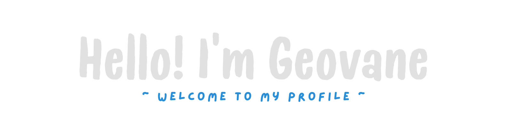
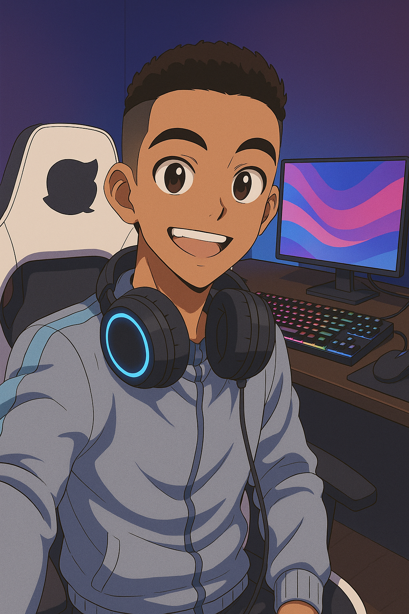

Sou apaixonado por tecnologia e desenvolvimento de software. Atualmente, curso **Engenharia de Computação no CEFET-MG** e estou em constante evolução na área de **desenvolvimento web**, com foco em **Front-End** e interesse crescente pelo universo **Full Stack**.
Combinando criatividade, lógica e curiosidade, busco construir soluções que realmente façam a diferença. Tenho atuado em projetos reais, tanto no estágio com **React, Typescript, C# e ASP.NET**, quanto em projetos pessoais para o desenvolvimento das minhas habilidades.
Acredito no poder do aprendizado contínuo e adoro compartilhar conhecimento, explorar novas tecnologias e contribuir com projetos que tenham propósito.  

###  Atualmente...
- Aprimorando minhas habilidades em inglês e desenvolvimento full stack por meio de cursos da Udemy e OneBitCode. 
- Aprendendo sobre Docker e sua aplicação com containers em ambientes de desenvolvimento.

###  Tecnologias que estou aprendendo
- React, Next.js e TypeScript são as bases do meu dia a dia como dev Front-End.
- Estou explorando o uso de Docker Desktop, Portainer e Docker Swarm no ambiente do estágio.

###  Vamos nos conectar!

 

##

###  Minhas Skills

### Linguagens e Tecnologias

### Frameworks e Bibliotecas

### Ferramentas e Plataformas

  

  
 GitHub Status

  

  
 Contribuições

  

  
 Principais Linguagens

  

<picture align="center">
  <source media="(prefers-color-scheme: dark)" srcset="https://raw.githubusercontent.com/geovanelelis/geovanelelis/output/github-contribution-grid-snake-dark.svg">
  <source media="(prefers-color-scheme: light)" srcset="https://raw.githubusercontent.com/geovanelelis/geovanelelis/output/github-contribution-grid-snake-dark.svg">
  
</picture>
  

